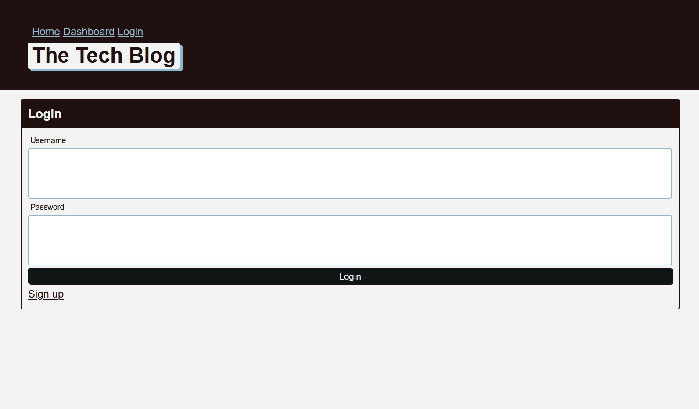

# MCV-Techblog

## The Task
To build a CMS-style blog site similar to a Wordpress site, where developers can publish their blog posts and comment on other developers’ posts as well. You’ll build this site completely from scratch and deploy it to Heroku. Your app will follow the MVC paradigm in its architectural structure, using Handlebars.js as the templating language, Sequelize as the ORM, and the express-session npm package for authentication.

## User Story
```md
AS A developer who writes about tech
I WANT a CMS-style blog site
SO THAT I can publish articles, blog posts, and my thoughts and opinions
``` 

### Requirements
Technical Acceptance Criteria: 40%
* Satisfies all of the preceding acceptance criteria plus the following:
    * Application’s folder structure follows the Model-View-Controller paradigm.
    * Uses the express-handlebars package to implement Handlebars.js for your Views
    * Application must be deployed to Heroku.

### Deployment: 32%
* Application deployed at live URL.
* Application loads with no errors.
* Application GitHub URL submitted.
* GitHub repository contains application code.

### Application Quality: 15%
* User experience is intuitive and easy to navigate.
* User interface style is clean and polished.
* Application resembles the mock-up functionality provided in the homework instructions.

### Repository Quality: 13%
* Repository has a unique name.
* Repository follows best practices for file structure and naming conventions.
* Repository follows best practices for class/id naming conventions, indentation, quality comments, etc.
* Repository contains multiple descriptive commit messages.
* Repository contains quality readme file with description, screenshot, and link to deployed application.

### Review
You are required to submit BOTH of the following for review:
* The URL of the functional, deployed application.
* The URL of the GitHub repository, with a unique name and a readme describing the project.

### Screenshot
